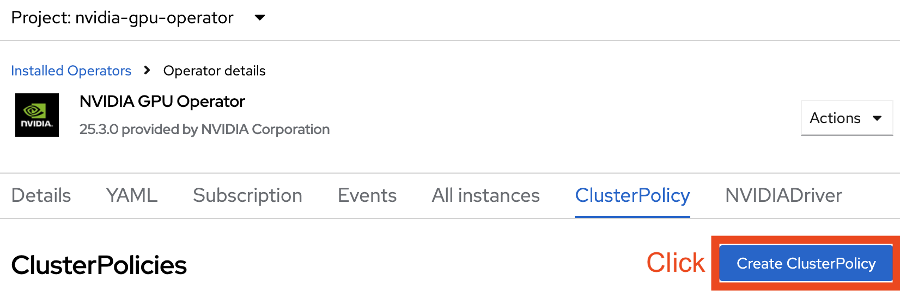

# NVIDIA vGPU on OpenShift

This repository serves as a complement to the [NVIDIA documentation on vGPUs on OpenShift](https://docs.nvidia.com/datacenter/cloud-native/openshift/latest/openshift-virtualization.html) to make it easier to deploy the solution on a OpenShift cluster

## Testing environment

This repository has been tested on:

* OpenShift 4.18.13 cluster (stable-4.18 channel)
  * NVIDIA GPU Operator v25.3.0
  * NVIDIA Driver 570.133.10
  * NVIDIA T4 GPU (AWS instance [g4dn.metal](https://instances.vantage.sh/aws/ec2/g4dn.metal))


## Prerequisites

The NVIDIA vGPU software needs to be obtained from the [NVIDIA Licensing Portal](https://nvid.nvidia.com/dashboard/#/dashboard):

(Following block is replicated from the NVIDIA documentation)

> [!NOTE]
> Login to the NVIDIA Licensing Portal and navigate to the Software Downloads section.
>
> The NVIDIA vGPU Software is located on the Driver downloads tab of the Software Downloads page.
>
> Click the Download link for the Linux KVM complete vGPU package. Confirm that the Product Version column shows the vGPU version to > install. Unzip the bundle to obtain the NVIDIA vGPU Manager for Linux file, NVIDIA-Linux-x86_64-<version>-vgpu-kvm.run.
>
> NVIDIA AI Enterprise customers must use the aie .run file for building the NVIDIA vGPU Manager image. Download the NVIDIA-Linux-x86_64-<version>-vgpu-kvm-aie.run file instead, and rename it to NVIDIA-Linux-x86_64-<version>-vgpu-kvm.run before proceeding with the rest of the procedure.


## Instructions

### Build Driver image on local machine

Since we need the proprietary drivers from NVIDIA, the easiest way to get started is by building the container image locally

Local requirements:
* git
* podman

```bash
git clone https://gitlab.com/nvidia/container-images/driver
cd driver/vgpu-manager/rhel8/
cp path/to/NVIDIA-Linux-x86_64-<version>-vgpu-kvm.run .

# the DRIVER_VERSION buildarg is from driver filename: NVIDIA-Linux-x86_64-570.133.10-vgpu-kvm.run
podman build --build-arg DRIVER_VERSION=570.133.10 -t nvidia-driver:latest .
```

### (Optional) Push to internal registry

Once we have the container image we can use the OpenShift image registry to host but you can also use another registry if available

In the example we are using the driver version and the version of OpenShift in the tag in the form "driver_version-rhcos_version": `570.133.10-rhcos4.18`

```bash
oc login https://api.cluster.example.com:6443 --username admin
oc registry login

podman tag nvidia-driver:latest image-registry.openshift-image-registry.svc:5000/nvidia-gpu-operator/vgpu-manager:570.133.10-rhcos4.18
podman push --tls-verify=false image-registry.openshift-image-registry.svc:5000/nvidia-gpu-operator/vgpu-manager:570.133.10-rhcos4.18
```

## Deploy GPU Operator

### Label the nodes

Nodes that will be used for vGPU should be labeled to ensure that the GPU operator installs the correct NVIDIA drivers

> [!WARNING]
If the workload label was unset or set incorrectly you will have to remove the kernel modules that are loaded in order to change the supported workload for the node (rebooting the node is sufficient).

(from the NVIDIA documentation)
> If the node label nvidia.com/gpu.workload.config does not exist on the node, the GPU Operator assumes the default GPU workload configuration, container, and deploys the software components needed to support this workload type. To change the default GPU workload configuration, set the following value in ClusterPolicy: .sandboxWorkloads.defaultWorkload=<config>.

```bash
oc label node ip-10-0-2-117.us-east-2.compute.internal --overwrite nvidia.com/gpu.workload.config=vm-vgpu
```
```
node/ip-10-0-2-117.us-east-2.compute.internal labeled
```

Check the full list of nodes for the labels, in this case only the first node will be set up for vGPU, the rest will get the standard container-based workload support for GPUs

```bash
oc get nodes -o custom-columns=Name:.metadata.name,GPU:.metadata.labels.'nvidia\.com/gpu\.workload\.config'
```
```
Name                                        GPU
ip-10-0-2-117.us-east-2.compute.internal    vm-vgpu
ip-10-0-42-92.us-east-2.compute.internal    <none>
ip-10-0-5-156.us-east-2.compute.internal    <none>
ip-10-0-58-169.us-east-2.compute.internal   <none>
ip-10-0-69-161.us-east-2.compute.internal   <none>
ip-10-0-78-66.us-east-2.compute.internal    <none>
```

### Install the vGPU manager image

#### With CLI

> [!NOTE]
> If you are using an external registry, change the registry URI in the YAML before applying

Apply the ClusterPolicy in this repository

```
oc apply -f clusterpolicy.yaml
```

#### With GUI

Once installing the GPU operator, add a new ClusterPolicy and switch to YAML




> [!NOTE]
> Modify the YAML and set the repository to the correct URL if you are not using the internal registry

Find the settings listed below and make sure they are set, leave everything else as the default

```
apiVersion: nvidia.com/v1
kind: ClusterPolicy
metadata:
  name: gpu-cluster-policy
spec:
  sandboxWorkloads:
    enabled: true
  vgpuManager:
    enabled: true
    image: vgpu-manager
    repository: image-registry.openshift-image-registry.svc:5000/nvidia-gpu-operator
    version: 570.133.10
...
```

### Verification

#### Check the node is advertising GPUs

```bash
oc get nodes ip-10-0-2-117.us-east-2.compute.internal -o json | jq .status.allocatable
```
```json
{
 "cpu": "95500m",
 "devices.kubevirt.io/kvm": "1k",
 "devices.kubevirt.io/tun": "1k",
 "devices.kubevirt.io/vhost-net": "1k",
 "ephemeral-storage": "191655242229",
 "hugepages-1Gi": "0",
 "hugepages-2Mi": "0",
 "memory": "394701388Ki",
 "nvidia.com/GRID_T4-8Q": "16",
 "nvidia.com/gpu": "0",
 "pods": "250"
}
```

## Configure OpenShift virtualization

### Modify Hyperconverged object

The `resourceName` should correspond to the name of the resource from the allocatable resources, in this example `nvidia.com/GRID_T4-8Q`

```yaml
apiVersion: hco.kubevirt.io/v1beta1
kind: HyperConverged
spec:
  featureGates:
    disableMDevConfiguration: true
  permittedHostDevices:
    mediatedDevices:
    - externalResourceProvider: true
      mdevNameSelector: GRID T4-8Q
      resourceName: nvidia.com/GRID_T4-8Q
```

After which, you should be able to create or modify a VM and add a GPU device.

## Other Verification and Debugging steps


#### Driver version
Ensure that the NVIDIA GPU drivers are the correct version

```bash
$ oc debug node/ip-10-0-2-117.us-east-2.compute.internal
```
```
Starting pod/ip-10-0-2-117us-east-2computeinternal-debug-pk9mk ...
To use host binaries, run `chroot /host`
Pod IP: 10.0.2.117
If you don't see a command prompt, try pressing enter.
$ cat /sys/module/nvidia/version
570.133.10
```

#### Check PCI cards are present

```
oc debug node/ip-10-0-2-117.us-east-2.compute.internal
```
```
Starting pod/ip-10-0-2-117us-east-2computeinternal-debug-pk9mk ...
To use host binaries, run `chroot /host`
Pod IP: 10.0.2.117
If you don't see a command prompt, try pressing enter.
sh-5.1# lspci -nnk -d 10de:
18:00.0 3D controller [0302]: NVIDIA Corporation TU104GL [Tesla T4] [10de:1eb8] (rev a1)
        Subsystem: NVIDIA Corporation Device [10de:12a2]
        Kernel driver in use: nvidia
lspci: Unable to load libkmod resources: error -2
19:00.0 3D controller [0302]: NVIDIA Corporation TU104GL [Tesla T4] [10de:1eb8] (rev a1)
        Subsystem: NVIDIA Corporation Device [10de:12a2]
        Kernel driver in use: nvidia
35:00.0 3D controller [0302]: NVIDIA Corporation TU104GL [Tesla T4] [10de:1eb8] (rev a1)
        Subsystem: NVIDIA Corporation Device [10de:12a2]
        Kernel driver in use: nvidia
36:00.0 3D controller [0302]: NVIDIA Corporation TU104GL [Tesla T4] [10de:1eb8] (rev a1)
        Subsystem: NVIDIA Corporation Device [10de:12a2]
        Kernel driver in use: nvidia
e7:00.0 3D controller [0302]: NVIDIA Corporation TU104GL [Tesla T4] [10de:1eb8] (rev a1)
        Subsystem: NVIDIA Corporation Device [10de:12a2]
        Kernel driver in use: nvidia
e8:00.0 3D controller [0302]: NVIDIA Corporation TU104GL [Tesla T4] [10de:1eb8] (rev a1)
        Subsystem: NVIDIA Corporation Device [10de:12a2]
        Kernel driver in use: nvidia
f4:00.0 3D controller [0302]: NVIDIA Corporation TU104GL [Tesla T4] [10de:1eb8] (rev a1)
        Subsystem: NVIDIA Corporation Device [10de:12a2]
        Kernel driver in use: nvidia
f5:00.0 3D controller [0302]: NVIDIA Corporation TU104GL [Tesla T4] [10de:1eb8] (rev a1)
        Subsystem: NVIDIA Corporation Device [10de:12a2]
        Kernel driver in use: nvidia
```
